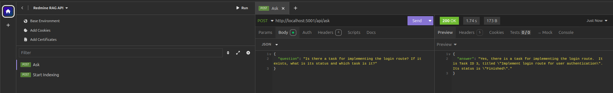

# Redmine AI 

**A Full-Stack, Production‑grade RAG Assistant for Redmine**  
Flask (Python) + LangChain + Google Gemini + ChromaDB + PostgreSQL + Docker

[](https://www.docker.com/)
[](https://www.python.org/)
[](https://flask.palletsprojects.com/)
[](https://www.langchain.com/)
[](https://ai.google/)
[](https://www.trychroma.com/)
[](https://www.postgresql.org/)
[](https://www.redmine.org/)

<p align="center">
  <em>Ask: “What’s the status of the login task?” — Get an answer instantly, without clicking through menus.</em>
</p>

---

## Overview

**Redmine AI** connects a **self‑hosted Redmine** to a **GenAI layer (Google Gemini)** via a robust **RAG** pipeline so you can **chat with your project data in natural language**.  
Everything is **containerized** with Docker and orchestrated with **Docker Compose** for reproducibility and true “works‑on‑any‑machine” portability.

> This is not a demo script. It’s a complete, production‑style environment: microservices, networks, volumes, backups and a clean Python codebase.

<p align="center">
  
</p>

<p align="center">
  
</p>

---

## Why It Matters

- **Instant answers:** Skip Redmine’s menus/filters; ask questions like a human.
- **Grounded responses:** Answers are generated **only** from your Redmine data (RAG), minimizing hallucinations.
- **Ops‑ready:** One‑command setup; portable backups; secrets configured; networks isolated.
- **Great for teams & portfolio:** Clear architecture, professional README, and real debugging stories that reflect work you’d do on the job.

---

## Architecture at a Glance

- **Data Source:** Redmine (Docker) + PostgreSQL (Docker) with persistent volumes.
- **AI API (Flask):** Python microservice exposing `/api/index` and `/api/ask`.
- **RAG Core (LangChain):**
  - **Extraction:** `python-redmine` fetches issues/projects.
  - **Embeddings:** `langchain-google-genai` with Google embeddings.
  - **Vector Store:** **ChromaDB** (Docker) for similarity search.
  - **Generation:** **Gemini 1.5 Pro** creates final answers from retrieved context.
- **Portability:** `pg_dump` backup + auto‑restore on first boot for instant demo on any machine.
- **Reliability:** Startup ordering & readiness logic so the API waits until Redmine is ready.

**[print]** Add an architecture diagram here (containers + data flow).

---

## Features

- 🔎 **Natural‑Language Q&A** over Redmine issues, projects, statuses, assignees, etc.
- 🧠 **RAG pipeline** (retrieve → re-rank → generate) grounded on your data.
- 🗃️ **ChromaDB** for fast semantic search.
- 🐳 **Full Docker stack**: Redmine, PostgreSQL, ChromaDB, AI API.
- 💾 **Portable Backups**: `pg_dump` + auto‑restore through Postgres’ init hooks.
- 🧰 **Battle‑tested debugging**: real issues solved (ports, keys, 404/429, race conditions).

---

## Tech Stack

- **Backend / API:** Python 3.11, Flask, `python-redmine`
- **AI / RAG:** LangChain, `langchain-google-genai`, Google **Gemini 1.5 Pro**, ChromaDB
- **Data:** Redmine + PostgreSQL
- **Infra:** Docker & Docker Compose

---

## Prerequisites

- Docker Engine + Docker Compose
- A Google **Gemini** API key (`GEMINI_API_KEY`) with **billing enabled**
- A Redmine API key (`REDMINE_API_KEY`) from your Redmine user settings
- A securely generated `REDMINE_SECRET_KEY_BASE` for Redmine

---

## Configuration

Copy `.env.example` to `.env` and fill in the keys:

```env
REDMINE_KEY=your_redmine_personal_access_token
GOOGLE_API_KEY=your_google_gemini_api_key
REDMINE_SECRET_KEY_BASE=your_long_random_secret
```

---

## Quick Start

1) **Clone & configure**
```bash
git clone https://github.com/Glasena/redmine-ia
cd redmine-ia
cp .env.example .env  # then edit with your keys
```

2) **(Optional) Seed demo data**  
Place a Redmine SQL backup at `db/init/redmine_backup.sql`. It will be auto‑restored on first boot.

3) **Boot the stack**
```bash
docker compose up -d --build
```

4) **Index Redmine data**  
This is automatically triggered by the API’s start command (`flask index`). You can also call it manually:

```bash
curl -X POST http://localhost:5001/api/index
```

---

## API Endpoints

### `POST /api/index`
Triggers (re)indexing of Redmine entities (projects, issues, etc.) into ChromaDB.

**Response**
```json
{
  "status": "ok",
  "indexed": 247
}
```

### `POST /api/ask`
Ask a natural‑language question grounded on your Redmine data.

**Request**
```json
{
  "question": "What is the current status of the Login feature task?"
}
```

**Response**
```json
{
  "answer": "The login route implementation (ID 3) is finished. However, there is a pending issue (ID 4) where the login button becomes unresponsive after an incorrect password attempt."
}
```

**[print]** Add a screenshot of a successful `/api/ask` call in Postman or curl.

---

## Debugging & Real‑World Lessons (What We Fixed)

- **Connection error — “Failed sending data to the peer”**  
  Root cause: **port mapping conflict** (`5001:5001` vs `5001:5000`). Fixed by aligning container and host ports.

- **Python `NameError`** (e.g., `documentos` vs `documents`)  
  Fixed inconsistent variable names and added linting checks.

- **Redmine startup failure** due to missing `REDMINE_SECRET_KEY_BASE`  
  Added env var + documented generation.

- **External API errors**: **404 Not Found** (wrong model name) and **429 Quota Exceeded**  
  - Listed available models and pinned to `gemini-1.5-pro-latest`  
  - Enabled **Google Cloud billing** to leave the free tier

- **Race condition** during boot: API tried to index before Redmine was ready  
  Added `sleep` + `flask index` bootstrap step. Consider healthchecks for production.

**[print]** Add logs screenshots showing before/after fixes.

---

## Portability & Backups

- **Backup** Redmine DB from the running Postgres container:
  ```bash
  docker exec -t <postgres_container> pg_dump -U redmine redmine > db/init/redmine_backup.sql
  ```
- **Auto‑restore**: Postgres’ init hooks (`/docker-entrypoint-initdb.d/`) automatically load `redmine_backup.sql` on first boot.  
  This makes the project instantly demoable on any machine.

---

## Credits & License

Built by **Glasena** as a professional, portfolio‑ready project.  
Licensed under **MIT** (adjust as needed).

---

## Example Requests

### Ask about an issue by keyword
```json
{
  "question": "Show me the status and assignee of the login task."
}
```

### Ask about overdue items in a project
```json
{
  "question": "Is there a task for implementing the login route? If it exists, what is its status and which task is it?"
}
```

### Reindex (after new issues)
```json
{
  "force": true
}
```